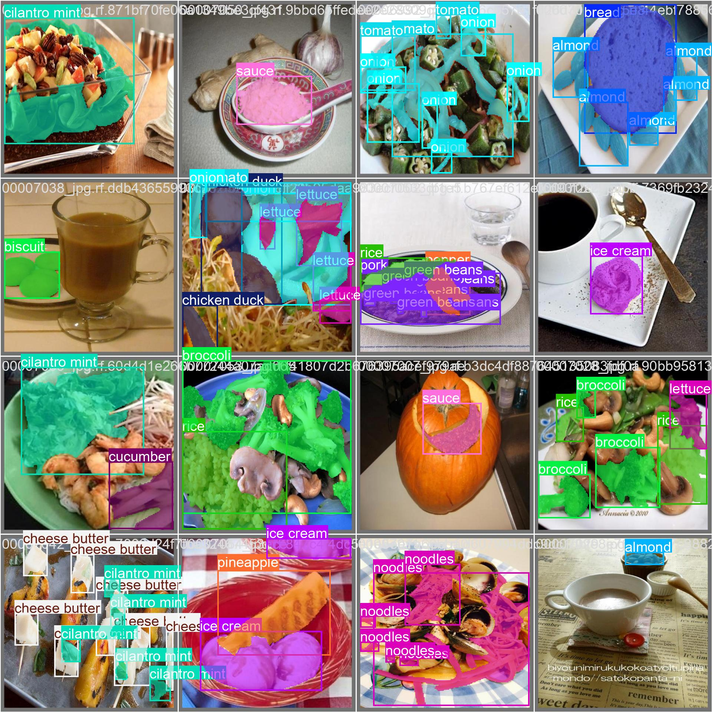

# 🥗 SmartPlate AI - Akıllı Besin Analiz Sistemi

SmartPlate AI, fotoğraflardan 40 farklı yemeği tanıyan ve kalori/makro değerlerini (Protein, Karbonhidrat, Yağ) anlık olarak hesaplayan yapay zeka destekli bir asistan uygulamasıdır.

## Öne Çıkan Özellikler
- **Data PreProcessing** 103 farklı yemek sınıfı veri setindeki dengesizlik nedeniyle en çok örneği olan 40 sınıfa düşürülüp modelin mAp değeri artırılmıştır.
- **Yapay Zeka Görsel Analiz** Çekilen fotoğraftan pixel masking yöntemi ile segmentasyon sonuçlarını birleştirilir. Referans nesneyi baz alarak heuristic hacim hesabı ile besin değerleri tahmin edilir.
- **Yapay Zeka Diyetisyen Yorumu:** Google Gemini API kullanarak tespit edilen kalori/makro değerlerini haftalık olarak yorumlanır.
- **Günlük ve Haftalık Özet:** O gün veya hafta içinde tüketilen toplam kalori ve makroların görsel takibine olanak sağlar.
- **Kişiye Özel Günlük Kalori** Kişiselleştirilmiş kalori hedefleri, bilimsel geçerliliği olan Mifflin-St Jeor ölçeği kullanılarak hesaplanır.
- **Modern Arayüz:** Streamlit ile geliştirilmiştir, kullanıcı dostudur.

## Kullanılan Teknolojiler
- **Dil:** Python 3.9+
- **Arayüz:** Streamlit
- **Yapay Zeka:** YOLOv8 Nano, Gemini 2.5 Flash
- **Veri İşleme:** Pandas, NumPy
- **Veritabanı:** SQLite 
- **Veri** Roboflow FoodSeg103
- **API** FastAPI

## Model Eğitimi (Training)
Model, **FoodSeg103** veri seti üzerinde **YOLOv8 Nano** mimarisi kullanılarak Google Colab ortamında eğitilmiştir. 
- Eğitim sürecine dair tüm detaylara `notebooks/` klasöründeki Colab dosyalarından ulaşabilirsiniz.
- Model ağırlıkları (`best.pt`) projenin ana dizininde yer almaktadır.

## Kurulum ve Çalıştırma
Projeyi bilgisayarınızda çalıştırmak için şu adımları izleyin:
-Projeyi bilgisayarınıza indirin (Klonlayın).
-Terminali açın ve kütüphaneleri yüklemek için şu komutu yazın:
pip install -r requirements.txt
-Proje klasöründe .env adında bir dosya açın ve içine kendi Gemini API anahtarınızı ekleyin.
-Uygulamayı başlatmak için terminale şu komutu yazın:
streamlit run app.py

## Model Performansı

